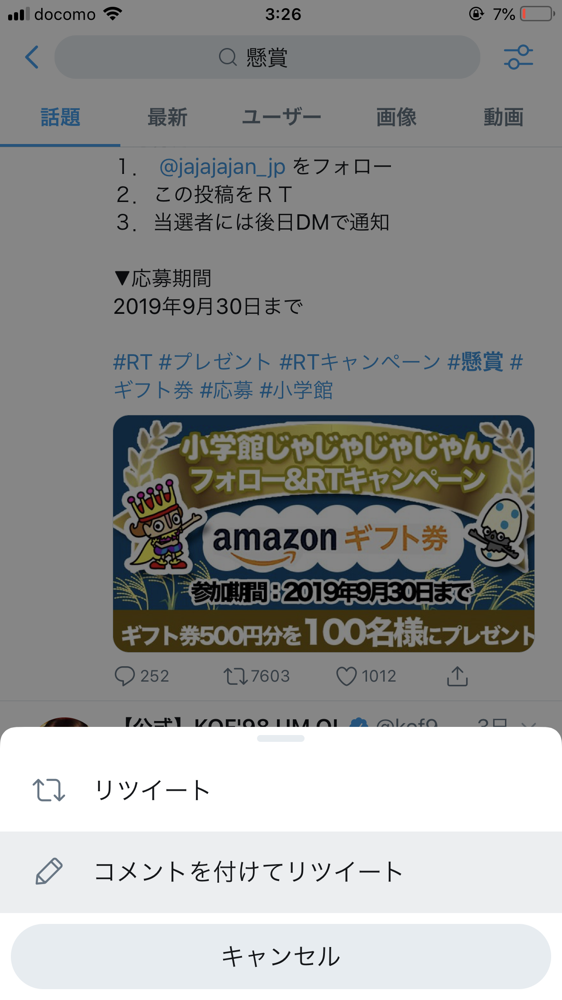
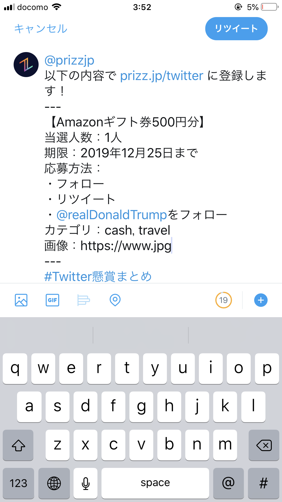

# Prizzに懸賞を登録する方法

Prizzには誰でも簡単に懸賞を登録することができるよ！！

もっとたくさんの人に企画に参加してもらえるチャンス！！


##登録方法

1. まず、登録したい懸賞ツイートの引用リツイートボタンを押してね！

   

   

2. 下のテンプレートをコピー＆ペーストして、懸賞の情報を書き込むよ。

   情報を記入できたら引用リツイートしてね！

```
@prizzjp
以下の内容で prizz.jp/twitter に登録します！
---
【Amazonギフト券500円分】
当選人数：1人
期限：2020年1月1日 18時まで
応募方法：
・フォロー
・リツイート
カテゴリ：gift
画像：2枚目
---
#Twitter懸賞まとめ
```




3. @prizzjpにリツイートされたら完了！5分以内にPrizzに追加されるよ！！


## カテゴリ一覧

カテゴリは下の表から選んでね！

１文字でもスペルを間違えると登録できないので、気をつけてね！

| **カテゴリ名** | **説明**           |
| :------------- | :----------------- |
| **appliance**  | 家電・パソコン     |
| **baby**       | ベビー・キッズ     |
| **books**      | 本・CD・DVD        |
| **cash**       | 現金               |
| **cosmetics**  | コスメ・美容       |
| **daily**      | 日用品             |
| **fashion**    | ファッション       |
| **foods**      | 食料品・ドリンク   |
| **gift**       | 商品券・ギフト券   |
| **goods**      | 雑貨・インテリア   |
| **kitchen**    | キッチン用品       |
| **movie**      | 映画・試写会       |
| **sports**     | 健康・スポーツ     |
| **stationery** | 文具               |
| **ticket**     | 招待・優待券       |
| **toy**        | ゲーム・おもちゃ   |
| **travel**     | 旅行・宿泊         |
| **vehicle**    | 車・バイク・自転車 |
| **other**      | その他             |


## 画像略称一覧

| 略称   | 説明                                                         |
| ------ | ------------------------------------------------------------ |
| amazon | Amazonギフト券 |
| google | Google Playカード |
| apple  | Apple Storeカード |
| gaa    | Amazon、Google、Appleのカード |


## テンプレートの詳しい説明


###（必須）**【＊＊＊＊＊＊＊】**
懸賞の賞品の名前だよ！**分かりやすく**書こう！
例）【カントリーマーム1年分】【現金10万円】


###（必須）**当選人数：＊人**
当選人数だよ！**分からない場合はなんとなくで**書こう！
例）当選人数：１人　　   当選人数: 30人


###（必須）**期限：＊＊＊＊年＊月＊日 ＊時まで**
応募締め切りだよ！その日の**24時までの場合は＊時を省略できる**よ！
例えば、「2019年12月31日まで」は「2020年1月1日0時0分0秒まで」と解釈されるよ！
例）2019年12月25日        ２０２０年７月７日　１９時


###（省略できる可）**応募方法：**
**・＊＊＊**
**・＊＊＊**

応募の方法だよ！基本形は

・@Aliceをフォロー
・https://twitter.com/Alice/status/123456をリツイート

だけど、例えば登録したい懸賞ツイートの投稿主が「@Alice」で、懸賞ツイートのURLが「https://twitter.com/Alice/123456」だった場合、

・フォロー
・リツイート

とだけ書いても上と**同じ様に解釈される**よ！
**条件は何個でも書いて良い**よ！

例）

応募方法：
・フォロー
・リツイート
・@Bobをフォロー
・https://twitter.com/Bob/123456をリツイート
・LINE登録

省略できるけど、**省略した場合には将来的に実装予定のワンクリック懸賞ができない**よ！


###（必須）カテゴリ：＊＊＊, ＊＊＊

懸賞のカテゴリだよ！選べるカテゴリは**カテゴリ一覧を参照**してね！
コンマ(,)か読点(、)で区切って**複数個かける**よ！

例）カテゴリ：sports, daily           カテゴリ：Movie、kitchen、Fashion


###（省略できる場合あり）画像：＊枚目

懸賞の画像だよ！一番目につくから一番重要な項目だ！
指定する方法は３つあるよ！

1. 登録したいツイートに画像が含まれている場合は、その**ツイートの「３枚目の画像」**みたいに指定できるよ！
2. 他にも、他のところから**拾ってきた画像のURL**を指定することもできるよ！
3. **画像略称一覧**にあるショートカットを使うこともできるよ！
   略称を使ってもらうとサイトが軽くなるので嬉しい！

※ツイートの**１枚目の画像を指定する場合に限って、項目ごと省略することができる**よ！！

例）画像：４枚目　　　画像：https://prizz.jp/xxxx.jpg             画像：amazon